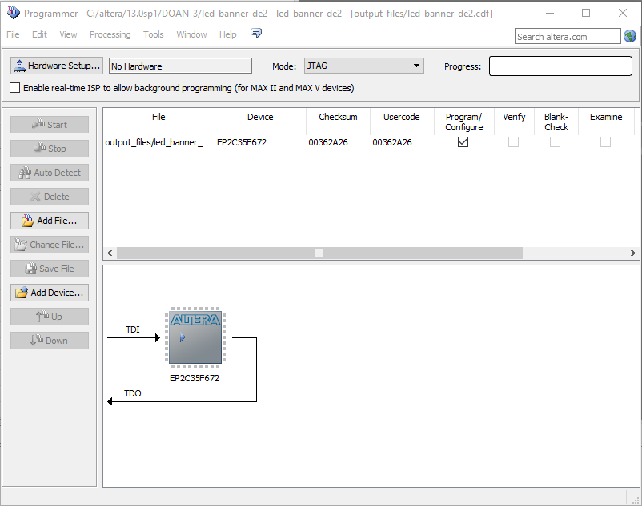
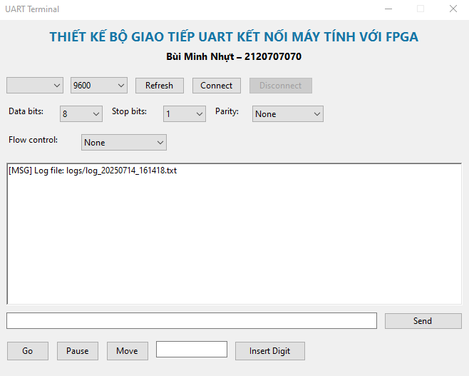

# Hướng dẫn sử dụng

Tài liệu này hướng dẫn cài đặt Quartus, nạp code lên DE2 và chạy ứng dụng Windows Forms.

## C.1 Cài đặt Quartus II 13.0 SP1

1. Tải bộ cài tại:  
   [Intel Quartus II Web Edition 13.0 SP1 for Windows](https://www.intel.com/content/www/us/en/software-kit/711791/intel-quartus-ii-web-edition-design-software-version-13-0sp1-for-windows.html?fbclid=IwY2xjawLgRXJleHRuA2FlbQIxMQABHkyloSfqtQ0dWzO3xFbs4YykVYJaZn2GDtg3DzeE0dwkK0IaghSVaG5qLzhh_aem_x0XiRf-Z6-pPnPj23MtUnA)  
2. Chạy file `.exe`, chọn đường dẫn cài đặt và các component cần thiết.  
3. Hoàn tất, khởi động Quartus II để kiểm tra.

## C.2 Nạp file .sof lên Board DE2

1. Mở Quartus II → **Tools → Programmer**.  
2. Chọn thiết bị USB-Blaster, nhấn **Auto Detect**.  
3. Nhấn **Add File…** và chọn `output_files/project.sof`.  
4. Nhấn **Start** để nạp.  

## C.3 Chạy ứng dụng GUI và cấu hình COM port

1. Mở file `UartTerminal.exe` trong thư mục `Release`. Giao diện sẽ như Hình 1.2.  
2. Nhấn **Refresh** để liệt kê các cổng COM hiện có trên máy.  
3. Tại dropdown **COM Port**, chọn đúng **COMx** tương ứng với thiết bị USB-UART (ví dụ COM3 hoặc COM4).  
4. Chọn các thông số sau:
   - **Baud rate**: 9600  
   - **Data bits**: 8  
   - **Stop bits**: 1  
   - **Parity**: None  
   - **Flow control**: None  
5. Nhấn **Connect** để mở kết nối tới FPGA. Khi thành công, nút **Disconnect** sẽ sáng lên và khung log sẽ hiện dòng “[MSG] Connected to COMx”.

